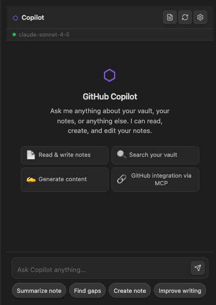
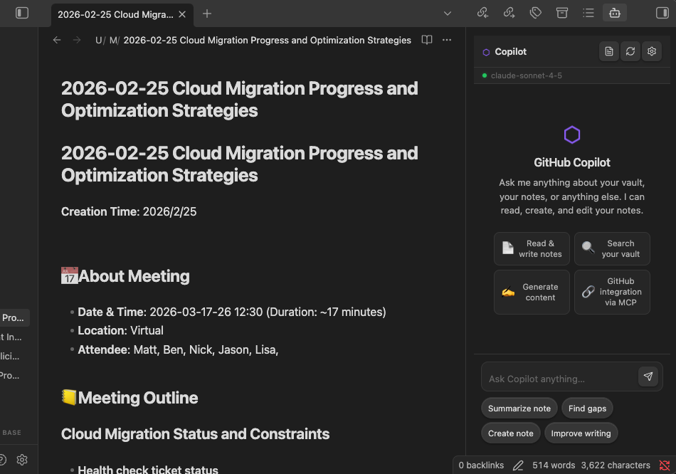

# GitHub Copilot for Obsidian

Bring GitHub Copilot's full agentic AI engine directly into your Obsidian vault. Chat, generate notes, search your knowledge base, and connect to GitHub — all without leaving Obsidian.


---


---
## Features

- **Chat panel** — Persistent sidebar chat with full markdown rendering, streaming responses, and session history
- **Vault-aware tools** — Copilot can read your active note, search your vault, create new notes, and append content — all via natural language
- **GitHub integration** — The Copilot CLI's built-in MCP GitHub server is available in every session: search issues, analyze PRs, summarize repos
- **Quick actions** — One-click pills for common tasks (summarize, find gaps, improve writing)
- **Append to note** — Push any AI response directly into your active note with one click
- **Model switching** — Choose between Claude Sonnet, GPT-5, Gemini, and more from settings
- **BYOK support** — Use your own API keys from Anthropic, OpenAI, or Azure AI Foundry
- **Theme compatible** — Uses Obsidian CSS variables; works with any community theme

---

## Prerequisites

### 1. GitHub Copilot subscription
You need an active GitHub Copilot subscription (Free, Pro, Pro+, Business, or Enterprise). Each Copilot message consumes one premium request from your plan allowance.

### 2. Copilot CLI installed & authenticated

```bash
# Install globally via npm
npm install -g @github/copilot

# Or via Homebrew (macOS)
brew install github-copilot

# Authenticate
copilot /login
```

Verify it works: `copilot --version`

### 3. Node.js 18+
Required for the `@github/copilot-sdk` package bundled with this plugin.

---

## Installation

### Manual (until listed in community plugins)

1. Clone or download this repo
2. Run `npm install && npm run build`
3. Copy `main.js`, `styles.css`, and `manifest.json` into:
   ```
   <your-vault>/.obsidian/plugins/obsidian-copilot/
   ```
4. In Obsidian: **Settings → Community plugins → Enable** → toggle on **GitHub Copilot**
5. Click the bot icon in the left ribbon, or use **Ctrl/Cmd+P → Open Copilot chat**

---

## Usage

### Chat panel
Open via the ribbon icon (🤖) or command palette. The panel opens in the right sidebar.

Type a message and press **Enter** to send. Use **Shift+Enter** for a newline.

### Quick action pills
Below the input, pre-built prompts for the most common vault tasks:
- **Summarize note** — Condenses your active note
- **Find gaps** — Identifies what's missing from a note
- **Create note** — Generates a new note from the conversation
- **Improve writing** — Rewrites for clarity and quality

### Note context
Click the **📄 file icon** in the toolbar (or toggle in settings) to automatically inject your active note's content with every message. Useful when you want Copilot to work on what you're currently editing.

### Vault tools
Copilot can autonomously call these tools during a session:

| Tool | What it does |
|---|---|
| `read_active_note` | Reads your currently open note |
| `read_note_by_path` | Reads any note by vault path |
| `append_to_active_note` | Appends content to your active note |
| `create_note` | Creates a new note in a specified folder |
| `search_vault` | Searches filenames and/or note content |
| `list_vault_structure` | Lists folders and files in a directory |
| `get_note_metadata` | Reads frontmatter, tags, and links |

### Commands (Command Palette)

| Command | Description |
|---|---|
| `Open Copilot chat` | Opens/focuses the chat panel |
| `Ask Copilot about selection` | Opens chat with selected text as context |
| `Summarize active note with Copilot` | Opens chat with summarize prompt pre-filled |
| `Reset Copilot session` | Clears session history and starts fresh |

---

## Settings

| Setting | Default | Description |
|---|---|---|
| CLI path | `copilot` | Path to Copilot CLI binary |
| Model | `claude-sonnet-4-5` | AI model for all interactions |
| Stream responses | on | Show tokens as they're generated |
| System message | *(see defaults)* | System prompt for every session |
| Auto-include active note | off | Inject active note context automatically |
| Max history length | 50 | Messages before oldest are trimmed |
| Show timestamps | on | Time sent under each message |
| Chat font size | 14px | Font size for the chat panel |

---

## Architecture

```
Obsidian Plugin (TypeScript/Electron)
  └─ @github/copilot-sdk (Technical Preview)
       └─ JSON-RPC → Copilot CLI (server mode)
                        └─ GitHub Copilot Agent Runtime
                             ├─ LLM (Claude / GPT / Gemini)
                             ├─ Built-in tools (fs, git, web)
                             ├─ GitHub MCP server
                             └─ Custom vault tools (this plugin)
```

The SDK communicates with the Copilot CLI as a subprocess via JSON-RPC. The plugin manages the full lifecycle: spawning, session creation, streaming, and teardown.

---

## Troubleshooting

**"Copilot CLI not found"**
- Ensure `copilot` is on your PATH: `which copilot`
- Or set the full binary path in plugin settings

**"Not authenticated with GitHub"**
- Run `copilot /login` in your terminal and complete the OAuth flow

**"Subscription required"**
- Check [github.com/settings/copilot](https://github.com/settings/copilot) that your plan is active

**Connection drops mid-conversation**
- The status bar will show "Disconnected" — click it to reconnect
- The CLI process may have timed out; use **Reset session** to start fresh

**Plugin won't load**
- Check Developer Tools console (Ctrl+Shift+I) for errors
- Ensure you're on Obsidian 1.4.0+
- Ensure Node.js 18+ is installed

---

## Notes on the SDK (Technical Preview)

The `@github/copilot-sdk` is currently in **technical preview** as of early 2026. It is functional but may have breaking changes before GA. This plugin will track SDK updates.

Each prompt consumes **one premium request** from your GitHub Copilot plan. Tool calls made by the agent during a single prompt may consume additional requests depending on plan tier.

---

## License

MIT — see LICENSE
